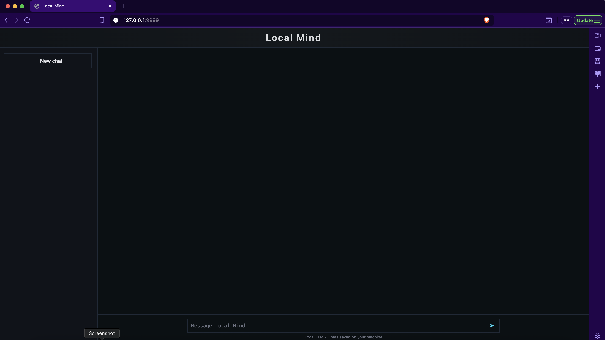
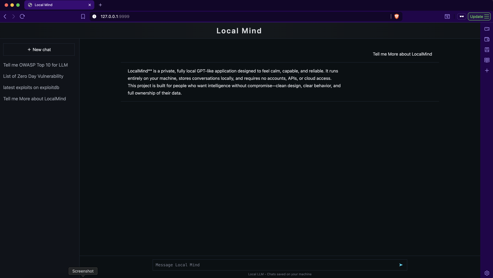

# LocalMind

**LocalMind** is a private, fully local application that runs entirely on your machine.  
It is designed to feel calm, capable, and reliable — without accounts, APIs, or cloud dependency.

Your conversations stay with you.  
Your AI runs locally.  
You stay in control.

---

## ✨ Features

- Clean user interface
- Dark theme with a clearly separated sidebar
- Chat history saved locally
- Multiple chats accessible from the sidebar
- Fully local LLM using Ollama (auto-download on first run)
- No accounts, no API keys, no cloud

---

## 🖼️ Preview

### LocalMind running locally
A calm, familiar interface that runs entirely on your machine.

### Launch & Overview
How to start LocalMind and what it looks like at first glance.


---

### Home Screen
The clean home interface of LocalMind, ready for conversation.



---

### 💬 Sending Your First Message
Send a message and interact with the local AI.


---

### Saved Conversations in sidebar
All chats are listed in the sidebar and stored locally.



---

## 🧰 Requirements (for users)

The following are required **only for users who clone the repository**:

- **Python 3.9 or newer**
- **Git**
- **Ollama**  
  👉 https://ollama.com

> You do **not** need API keys or online services.

---

## 🧠 How it works

The backend is powered by FastAPI

The LLM runs locally using Ollama

The frontend is a clean HTML/CSS/JavaScript interface

Chat history is saved locally in a JSON file

No data is sent anywhere

Everything happens on your machine.

---

## 🚀 Installation & Usage


```bash

1️⃣ Clone the repository

git clone https://github.com/YOUR_USERNAME/LocalMind.git
cd LocalMind

2️⃣ Install Ollama

Download and install Ollama from:
https://ollama.com

Verify installation:
ollama --version

After Verification:
ollama pull phi3

3️⃣ Run LocalMind

macOS / Linux
chmod +x run.sh
./run.sh

Windows
python -m pip install -r backend/requirements.txt
python -m uvicorn backend.main:app --host 127.0.0.1 --port 9999

4️⃣ Open in browser

http://127.0.0.1:9999


That’s it.
